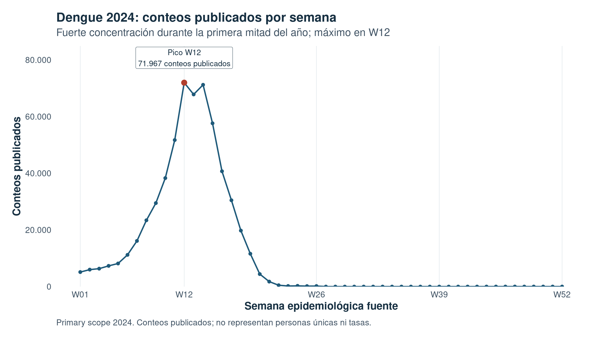
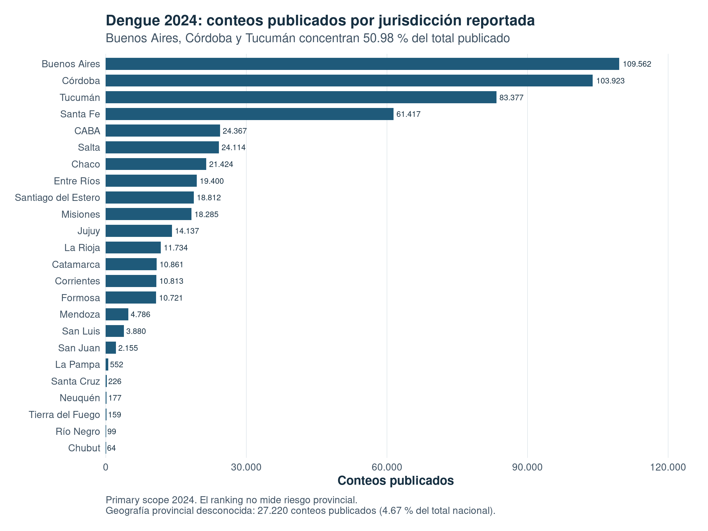
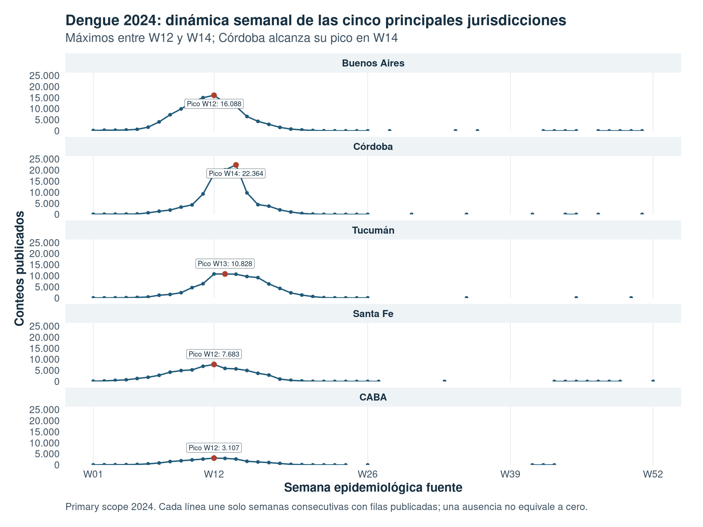
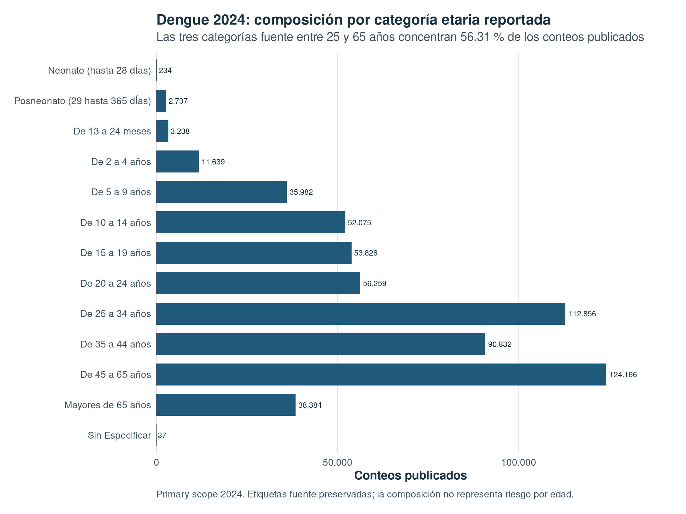

# Argentina Dengue Surveillance

## Reproducible public-health data engineering and descriptive analysis in R

This project turns official Argentine dengue-and-Zika surveillance releases into
a reproducible, contract-first data pipeline. It demonstrates scientific data
analysis and reproducible data engineering applied to public-health surveillance
data: raw-data integrity, resource provenance, schema drift, heterogeneous
encodings, explicit analytical scope, and careful communication of uncertainty.

The portfolio analysis focuses on **published Dengue counts for 2024** from the
Argentine Ministry of Health dataset published through
[Datos Argentina](https://datos.gob.ar/dataset/salud-vigilancia-enfermedades-por-virus-dengue-zika).
These values are not deduplicated people, incidence, prevalence, or risk
measures.

## Portfolio highlights

- **W12 was the annual weekly maximum:** 71,967 published counts.
- **W12–W15 contained 46.14%** of the annual published-count total.
- **Buenos Aires, Córdoba, and Tucumán accounted for 50.98%** of the full
  published total.
- **The five highest-count jurisdictions peaked between W12 and W14;** Córdoba
  peaked in W14.
- **Unknown provincial geography accounted for 4.67%** of the annual total and
  was concentrated in W15–W19.

These are descriptive properties of the selected published records. They do
not establish incidence, causal mechanisms, or differences in individual risk.

## Descriptive figures

### Weekly national pattern

The published counts concentrate in the first half of the year and reach their
maximum at W12. The line displays all observed W01–W52 values; it is not a
smoothed time series.

*Published counts in the 2024 primary scope; not unique people or rates.*

### Reported provincial categories

The ranking uses the 24 known provincial categories. 99 / desconocida is
preserved in the denominator and reported separately rather than being shown as
a province.

*A ranking of published counts, not a provincial risk comparison.*

### Weekly dynamics of the five highest-count jurisdictions

The panels retain only observed province-week combinations. A missing point
means no published row for that combination, not a zero-valued observation.

*Each line connects consecutive observed weeks only; it does not impute absent
weeks.*

### Reported age-category composition

Age labels remain exactly as supplied by the source, including dÍas and Sin
Especificar. The displayed shares describe composition of published counts,
not age-specific risk.

*The three source categories from 25 to 65 years contain 56.31% of published
counts.*

## Why focus on 2024?

The upstream pipeline processes and preserves canonical 2018, 2022, 2024, and
2025 resources. It deliberately does **not** turn them into a longitudinal
comparison: their schemas, coverage, encodings, and semantic evidence do not
justify treating them as directly comparable observations.

The primary 2024 scope was selected because its canonical resource has 52
published weeks, coherent structural coverage within the selected scope, and a
deterministic editorial selection among multiple non-identical 2024 snapshots.
The selected resource is the latest source revision under the documented
metadata rule; this is reproducible editorial precedence, not a claim that it
is epidemiologically more true.

## Method in brief

~~~
Official CKAN metadata
        ↓
Immutable raw-data acquisition
        ↓
Integrity, provenance, and CSV validation
        ↓
Canonical resource selection
        ↓
Structural harmonization with source-row provenance
        ↓
Quality assessment without corrective transformations
        ↓
Explicit primary analysis scope: Dengue, 2024
        ↓
Deterministic published-count analysis tables
        ↓
Curated portfolio figures
~~~

Each numbered script has one responsibility:

| Stage | Script | Purpose |
| --- | --- | --- |
| C.2 | 00_fetch_metadata.R | Query CKAN and build the internal resource catalog. |
| C.3 | 01_download_data.R | Download eligible resources with staging, SHA-256, atomic publication, and provenance logging. |
| C.4 | 02_validate_downloads.R | Validate local integrity, attributable provenance, and minimal CSV readability. |
| C.5 | 03_select_canonical_resources.R | Select one canonical resource per equivalent temporal coverage. |
| C.6 | 04_harmonize_canonical_resources.R | Preserve source records in a common structural schema. |
| C.7 | 05_assess_harmonized_quality.R | Record quality findings without changing observations. |
| C.8 | 06_select_analysis_scope.R | Select the explicit primary Dengue 2024 scope. |
| C.9 | 07_build_analysis_tables.R | Derive reconciled weekly, provincial, and age-group published-count tables. |
| C.10 | 08_generate_figures.R | Render the four curated PNG portfolio figures. |

## Methodological decisions that protect traceability

### Preserve uncertainty instead of silently cleaning it

The pipeline found exact duplicates, visible-dimension groups with different
published counts, an observed text anomaly (dÍas), and unknown geography. It
records and preserves those findings rather than silently deleting, recoding,
or consolidating them without evidence.

### Keep event scope explicit

The portfolio scope contains only the source event Dengue. It does not add
Dengue durante la gestación, because the available evidence does not establish
that it is mutually exclusive from the general event. Zika is outside the
configured primary scope.

### Do not manufacture absent observations

No missing week or province-week combination is filled with zero. No
geographical or age-category recoding is introduced without evidence. These
choices prevent presentation convenience from becoming an undocumented data
transformation.

## Limitations

- Published counts are not deduplicated unique people.
- There are no population denominators, so this project does not estimate
  incidence or geographic/age-specific risk.
- Schema and semantic changes prevent a defensible 2018–2025 comparison in the
  current scope.
- Published duplicates and count conflicts remain in the selected data because
  their error status is not established.
- Unknown geography and source-reported age categories are retained.
- The temporal pattern is descriptive; it does not identify causes.

## Reproduce from a clean clone

### Requirements

- R >= 4.1
- Internet access for metadata acquisition and first-time raw downloads
- A working system TLS trust store for the official portal

From the project directory:

~~~r
install.packages("renv") # only when renv is not already installed
renv::restore()
renv::status()
~~~

The pipeline is intentionally executed as individual scripts; there is no
invented master command.

~~~bash
# Online acquisition: requires CKAN and portal access.
Rscript scripts/acquisition/00_fetch_metadata.R
Rscript scripts/acquisition/01_download_data.R

# Local pipeline: requires the downloaded raw files and download log.
Rscript scripts/validation/02_validate_downloads.R
Rscript scripts/processing/03_select_canonical_resources.R
Rscript scripts/processing/04_harmonize_canonical_resources.R
Rscript scripts/processing/05_assess_harmonized_quality.R
Rscript scripts/processing/06_select_analysis_scope.R
Rscript scripts/analysis/07_build_analysis_tables.R
Rscript scripts/visualization/08_generate_figures.R
~~~

The official portal previously served an incomplete TLS certificate chain in
the development environment. The acquisition scripts fail closed when
certificate validation fails; do not disable TLS verification. Once official
access and raw files are available, C.3 can reuse locally verified files
without downloading them again.

Raw files, operational logs, validation snapshots, and processed CSVs are
regenerated and ignored by Git. The resource catalog and canonical-selection
manifest are versioned provenance metadata. The four PNG files in figures/ are
versioned portfolio deliverables and are regenerated by C.10.

## Repository structure

~~~text
config/                 Central project configuration
data/
  raw/                  Immutable official downloads (Git-ignored)
  metadata/             Provenance metadata and operational snapshots
  processed/            Regenerable derived CSV artifacts (Git-ignored)
docs/                   Architecture, contracts, and methodological records
figures/                Four versioned C.10 portfolio figures
scripts/                Numbered pipeline stages and shared utilities
~~~

## Contract-first design

Each material hand-off is documented before implementation. The main contracts
cover [resource metadata](docs/resources_catalog_contract.md),
[download provenance](docs/download_log_contract.md),
[validation](docs/validation_snapshot_contract.md),
[canonical selection](docs/canonical_resource_selection_contract.md),
[structural harmonization](docs/structural_harmonization_contract.md),
[quality assessment](docs/harmonized_quality_assessment_contract.md),
[analysis scope](docs/analysis_scope_selection_contract.md),
[analysis tables](docs/analysis_table_derivation_contract.md), and
[portfolio visualization](docs/portfolio_descriptive_visualization_contract.md).

See [project architecture](docs/project_architecture.md) for the complete
pipeline and [analysis protocol](docs/analysis_protocol.md) for the current
methodological scope.

## Technology

- R and renv
- YAML configuration
- httr2 and openssl for secure acquisition
- dplyr, readr, purrr, and tibble for data processing
- ggplot2 for deterministic portfolio figures
- Git and GitHub for version control and reviewable provenance

## Status

The reproducible acquisition-to-visualization pipeline is complete for the
current portfolio scope. Future work can add a narrative report, maps,
population-adjusted measures, or broader comparisons only through new,
explicitly documented policies.
