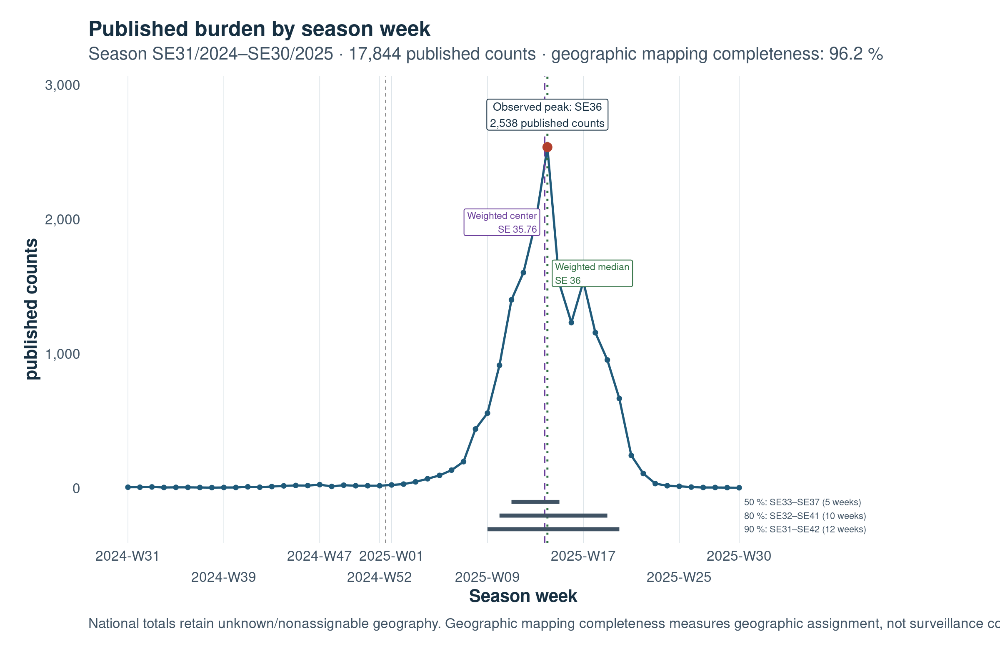
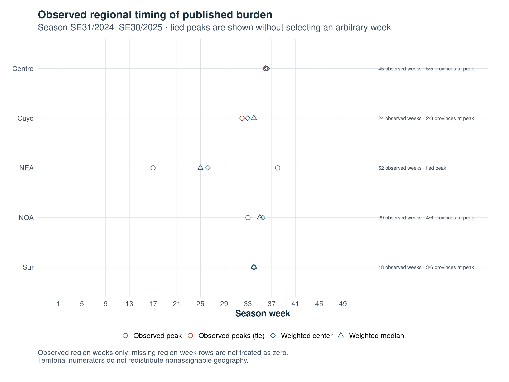
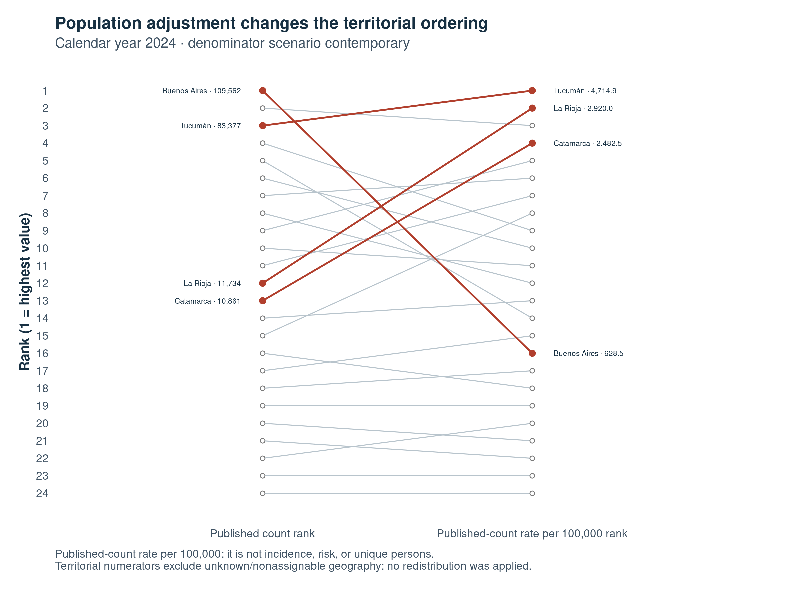
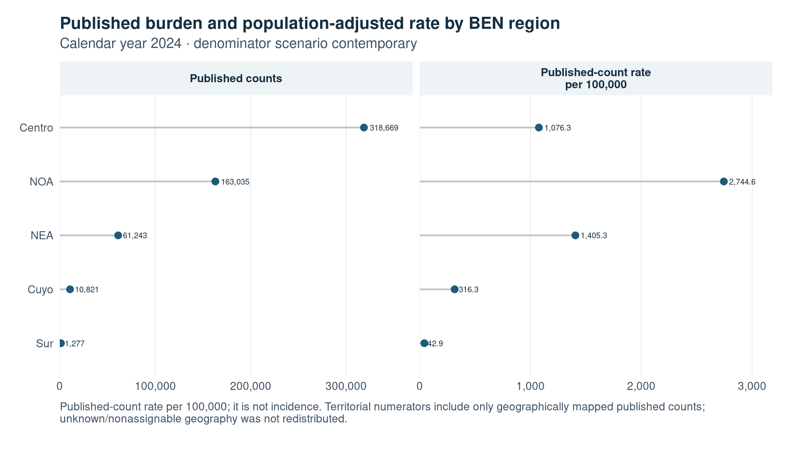

```{r}
#| label: setup
#| include: false

project_root <- normalizePath(if (file.exists("config/project.yml")) "." else "..", mustWork = TRUE)
required_packages <- c("yaml", "readr", "dplyr", "tibble")
if (!all(vapply(required_packages, requireNamespace, logical(1), quietly = TRUE))) {
  stop("The report requires yaml, readr, dplyr, and tibble.", call. = FALSE)
}
config <- yaml::read_yaml(file.path(project_root, "config", "project.yml"))

abort_report <- function(message) stop(message, call. = FALSE)
require_columns <- function(data, columns, key) {
  missing <- setdiff(columns, names(data))
  if (length(missing)) abort_report(sprintf("Certified artifact '%s' is missing: %s.", key, paste(missing, collapse = ", ")))
}
read_artifact <- function(key, columns) {
  relative_path <- config$artifacts[[key]]
  if (is.null(relative_path) || !nzchar(relative_path)) abort_report(sprintf("Missing artifacts.%s in config/project.yml.", key))
  path <- file.path(project_root, relative_path)
  if (!file.exists(path)) abort_report(sprintf("Required certified artifact is unavailable: %s.", relative_path))
  data <- readr::read_csv(path, show_col_types = FALSE, progress = FALSE)
  require_columns(data, columns, key)
  data
}
one_row <- function(data, label) {
  if (nrow(data) != 1L) abort_report(sprintf("Expected one %s row; found %s.", label, nrow(data)))
  data
}
format_count <- function(value) formatC(as.integer(round(value)), format = "d", big.mark = ",")
format_rate <- function(value) sprintf("%.1f", value)
format_percent <- function(value) sprintf("%.1f%%", 100 * value)
format_week <- function(value) sprintf("SE%02d", as.integer(value))
html_escape <- function(value) {
  value <- gsub("&", "&amp;", value, fixed = TRUE)
  value <- gsub("<", "&lt;", value, fixed = TRUE)
  gsub(">", "&gt;", value, fixed = TRUE)
}
render_html_table <- function(data) {
  header <- paste0("<th scope=\"col\">", html_escape(names(data)), "</th>", collapse = "")
  rows <- apply(data, 1L, function(row) paste0("<tr>", paste0("<td>", html_escape(trimws(as.character(row))), "</td>", collapse = ""), "</tr>"))
  cat(paste0("<table><thead><tr>", header, "</tr></thead><tbody>", paste(rows, collapse = ""), "</tbody></table>\n"))
}

season_scope_id <- config$epidemiological_season$scope_id
season_label <- config$epidemiological_season$season_label
policy <- config$epidemiological_portfolio_visualization
calendar_scope_id <- policy$calendar_year_scope_id
calendar_year <- policy$calendar_year
scenario <- policy$rate_denominator_scenario

season_summary <- read_artifact("season_national_summary", c("season_scope_id", "season_label", "season_published_case_count", "season_geographic_mapping_completeness", "season_unknown_published_case_count")) |> dplyr::filter(.data$season_scope_id == season_scope_id) |> one_row("season national summary")
national_temporal <- read_artifact("season_temporal_national_summary", c("season_scope_id", "peak_count_selection_status", "peak_count_tied_season_week_indices", "peak_count_season_week_index", "published_count_weighted_season_week", "published_count_weighted_median_season_week")) |> dplyr::filter(.data$season_scope_id == season_scope_id) |> one_row("national temporal descriptor")
regional_temporal <- read_artifact("season_temporal_region_summary", c("season_scope_id", "epidemiological_region", "regional_temporal_coverage_basis", "peak_count_selection_status", "peak_count_tied_season_week_indices", "peak_region_observed_province_count", "peak_region_total_province_count")) |> dplyr::filter(.data$season_scope_id == season_scope_id)
nea_temporal <- regional_temporal |> dplyr::filter(.data$epidemiological_region == "NEA") |> one_row("NEA temporal descriptor")
windows <- read_artifact("season_temporal_national_concentration_windows", c("season_scope_id", "target_share", "window_length_weeks")) |> dplyr::filter(.data$season_scope_id == season_scope_id)
window_length <- function(target) windows |> dplyr::filter(.data$target_share == target) |> one_row(sprintf("national concentration window for %.0f%%", 100 * target)) |> dplyr::pull(.data$window_length_weeks)

national_summary <- read_artifact("epidemiology_national_summary", c("analysis_scope_id", "denominator_scenario", "published_case_count", "national_population", "published_count_rate_100k", "observed_week_set")) |> dplyr::filter(.data$analysis_scope_id == calendar_scope_id, .data$denominator_scenario == scenario) |> one_row("calendar-year national summary")
province_summary <- read_artifact("epidemiology_province_summary", c("analysis_scope_id", "denominator_scenario", "reference_province_id", "reference_province_name", "published_case_count", "province_population", "published_count_rate_100k", "geographic_mapping_completeness")) |> dplyr::filter(.data$analysis_scope_id == calendar_scope_id, .data$denominator_scenario == scenario)
region_summary <- read_artifact("epidemiology_region_summary", c("analysis_scope_id", "denominator_scenario", "epidemiological_region", "published_case_count", "regional_population", "published_count_rate_100k")) |> dplyr::filter(.data$analysis_scope_id == calendar_scope_id, .data$denominator_scenario == scenario)
if (nrow(province_summary) != 24L || nrow(region_summary) != 5L || national_temporal$peak_count_selection_status != "unique_peak") abort_report("Certified artifacts do not support the report's required scope statements.")

count_ranks <- province_summary |> dplyr::arrange(dplyr::desc(.data$published_case_count), .data$reference_province_id) |> dplyr::mutate(count_rank = dplyr::row_number()) |> dplyr::select("reference_province_id", "reference_province_name", "published_case_count", "count_rank")
rate_ranks <- province_summary |> dplyr::arrange(dplyr::desc(.data$published_count_rate_100k), .data$reference_province_id) |> dplyr::mutate(rate_rank = dplyr::row_number()) |> dplyr::select("reference_province_id", "published_count_rate_100k", "rate_rank")
featured_policy <- dplyr::bind_rows(lapply(policy$featured_provinces, tibble::as_tibble)) |> dplyr::mutate(display_order = dplyr::row_number())
featured <- featured_policy |> dplyr::left_join(count_ranks, by = "reference_province_id", suffix = c("_expected", "")) |> dplyr::left_join(rate_ranks, by = "reference_province_id", suffix = c("_expected", "")) |> dplyr::arrange(.data$display_order)
if (anyNA(featured$reference_province_name) || any(featured$count_rank_expected != featured$count_rank) || any(featured$rate_rank_expected != featured$rate_rank)) abort_report("Featured provincial ranks do not match the certified C.20 policy.")
featured_value <- function(province_id, field) featured |> dplyr::filter(.data$reference_province_id == province_id) |> dplyr::pull(dplyr::all_of(field))
annual_unknown_count <- national_summary$published_case_count - sum(province_summary$published_case_count)
annual_unknown_share <- annual_unknown_count / national_summary$published_case_count
if (annual_unknown_count < 0) abort_report("Mapped provincial published counts exceed the national published-count total.")
```

# Executive summary

This portfolio report describes official Argentine public surveillance data as published by the Ministry of Health through Datos Argentina, together with official INDEC population denominators. It reports published counts and published-count rates per 100,000; it does not estimate unique people, incidence, individual risk, infection probability, or causal effects. Two non-interchangeable analytical scopes are kept separate: seasonal timing covers `r season_label`, whereas geographic count-rate comparisons use calendar year `r calendar_year` and the contemporary denominator scenario.

The seasonal scope contains `r format_count(season_summary$season_published_case_count)` published counts. Its observed peak is `r format_week(national_temporal$peak_count_season_week_index)`, and half of the published-count total occurs within the shortest observed five-week concentration window. Regional descriptors differ across observed region weeks, including a contractual NEA peak tie rather than an arbitrarily selected single week. In calendar year `r calendar_year`, population adjustment substantially changes provincial ordering: Buenos Aires moves from first by published count to sixteenth by published-count rate, while Tucumán moves from third to first. At BEN-region level, Centro has the highest published count and NOA the highest published-count rate. These patterns are reproducible descriptions of certified artifacts, not statements about surveillance completeness, epidemic duration, or comparative individual risk.

# Data, provenance, and analytical scope

The report consumes only certified summary and descriptor artifacts and the four versioned English C.20 figures. It does not read raw files, execute pipeline stages, download data, reconstruct rates, or regenerate graphics. The official surveillance source is the [Datos Argentina metadata endpoint](`r config$api$package_show_url`), and the contemporary population source is the [INDEC July 1 projection](`r config$population_reference$sources$indec_census_2022_projection_2022_2040$source_landing_url`).

::: {.callout-important}
## Two analytical scopes

**Seasonal timing:** `r season_label`

**Geographic count-rate comparisons:** calendar year `r calendar_year`; contemporary denominator scenario.

These metrics refer to distinct analytical periods and are not interchangeable.
:::

```{r}
#| label: tbl-scope-measure-matrix
#| tbl-cap: "Scope and measure matrix."
#| results: asis

scope_matrix <- tibble::tibble(`Analytical scope` = c("Seasonal timing", "Geographic count-rate comparisons"), Period = c(season_label, paste("Calendar year", calendar_year)), Metric = c("Published counts and observed temporal descriptors", "Published counts and published-count rates per 100,000"), Geography = c("National and BEN-region summaries", "National, province, and BEN-region summaries"), Denominator = c("Not used for the reported seasonal descriptors", "Contemporary INDEC population, July 1 reference date"), `Principal interpretation limit` = c("Observed timing is not epidemic duration or surveillance completeness", "Rate is not incidence, individual risk, or a complete geographic numerator"))
render_html_table(scope_matrix)
```

# National seasonal timing

The `r season_label` scope contains `r format_count(season_summary$season_published_case_count)` published counts. Its observed national maximum occurs at `r format_week(national_temporal$peak_count_season_week_index)`. The published-count-weighted temporal center is `r sprintf("%.2f", national_temporal$published_count_weighted_season_week)` season weeks, and the weighted median is `r format_week(national_temporal$published_count_weighted_median_season_week)`. The shortest contiguous observed windows reaching 50%, 80%, and 90% of the published-count total span `r window_length(0.5)`, `r window_length(0.8)`, and `r window_length(0.9)` weeks, respectively. They describe concentration in the configured season; they do not define epidemic duration.

National published counts retain `r format_count(season_summary$season_unknown_published_case_count)` records with unknown or nonassignable geography. Geographic mapping completeness is `r format_percent(season_summary$season_geographic_mapping_completeness)`: it measures geographic assignment within this scope, not surveillance completeness.

<figure id="fig-national-season">

<figcaption>National seasonal profile of published counts for the configured season.</figcaption>
</figure>

# Regional observed timing

Regional descriptors use observed region weeks only. A missing region-week row is not treated as zero, so observed-week coverage and peak-province coverage condition any comparison. Timing differs among regions, but the report does not characterize this as propagation or arrival.

NEA has the contractual peak tie `r paste0("SE", gsub("\\|", "|SE", nea_temporal$peak_count_tied_season_week_indices))`. No arbitrary single peak is selected. Lags are therefore discussed only where the certified descriptor identifies unique peaks.

<figure id="fig-regional-timing">

<figcaption>Observed regional timing descriptors for the configured season.</figcaption>
</figure>

# Population adjustment and provincial rank shifts

**Scope:** Calendar year `r calendar_year`; contemporary denominator scenario.

Absolute published counts and population-adjusted published-count rates answer different descriptive questions. The certified ranking comparison shows the following shifts:

- Buenos Aires: count rank `r featured_value("06", "count_rank")` to rate rank `r featured_value("06", "rate_rank")`.
- Tucumán: count rank `r featured_value("90", "count_rank")` to rate rank `r featured_value("90", "rate_rank")`.
- La Rioja: count rank `r featured_value("46", "count_rank")` to rate rank `r featured_value("46", "rate_rank")`.
- Catamarca: count rank `r featured_value("10", "count_rank")` to rate rank `r featured_value("10", "rate_rank")`.

Territorial numerators include only geographically mapped published counts; unknown or nonassignable geography is not redistributed.

<figure id="fig-province-ranks">

<figcaption>Provincial count and population-adjusted rate rank shifts in calendar year 2024.</figcaption>
</figure>

```{r}
#| label: tbl-featured-provinces
#| tbl-cap: "Featured provincial contrasts in calendar year 2024, contemporary denominator scenario."
#| results: asis

featured_table <- featured |> dplyr::transmute(Province = .data$reference_province_name, `Published count` = format_count(.data$published_case_count), `Count rank` = .data$count_rank, `Published-count rate per 100,000` = format_rate(.data$published_count_rate_100k), `Rate rank` = .data$rate_rank)
render_html_table(featured_table)
```

# Regional published burden and population-adjusted rates

**Scope:** Calendar year `r calendar_year`; contemporary denominator scenario.

At BEN-region level, the published-count ordering is Centro, NOA, NEA, Cuyo, and Sur. The published-count-rate ordering is NOA, NEA, Centro, Cuyo, and Sur. This regional view complements the provincial rank comparison by showing the same two measures on a coarser, documented geography. It does not convert the rate into a measure of individual risk.

<figure id="fig-regional-burden">

<figcaption>BEN-region published burden and population-adjusted rates in calendar year 2024.</figcaption>
</figure>

# Interpretation limits and data quality

## What the analysis supports

- Reproducible description of published counts and published-count rates per 100,000.
- Observed seasonal timing and explicitly bounded concentration descriptors.
- Documented geographic mapping completeness and transparent treatment of unknown geography.
- An explicit denominator sensitivity assessment whose main rankings and interpretations were largely stable.

## What it does not support

- Counts of unique people, deduplicated records, incidence, individual risk, infection probability, or causal inference.
- Redistribution of unknown or nonassignable geography.
- Zero-filled missing region weeks.
- Direct interannual comparison of annual totals or a cumulative seasonal rate.

The two unknown-geography quantities remain scope-specific. The seasonal scope retains `r format_count(season_summary$season_unknown_published_case_count)` nonassignable published counts and has `r format_percent(season_summary$season_geographic_mapping_completeness)` geographic mapping completeness. Calendar year `r calendar_year` has `r format_count(annual_unknown_count)` unknown-province published counts, equivalent to `r format_percent(annual_unknown_share)` of its national published-count total. They are not measurements of the same period.

# Methods and reproducibility

## Official data and provenance

The surveillance artifacts originate in official public releases published through Datos Argentina. Population denominators are official INDEC projections with a July 1 reference date. The report uses the contemporary scenario for calendar-year rate displays. Formal bibliography metadata is not yet present in the project; it is intentionally not invented here.

## Resource selection and structural preparation

Immutable raw inputs, SHA-256 provenance, versioned contracts, validation, and deterministic canonical resource selection establish the certified analytical lineage. Structural preparation preserves source-row provenance rather than silently resolving semantic or quality uncertainty. The relevant contract records are available in the versioned [project documentation](../docs/project_architecture.md).

## Analytical scopes and geographic handling

The report keeps seasonal timing separate from calendar-year geographic rates. National summaries retain unknown geography. Provincial and regional numerators use only geographically mapped published counts, and no unknown geography is redistributed.

## Population-adjusted indicators and seasonal descriptors

The rate is calculated from published counts and official population denominators; it is not a person-level measure. Weekly seasonal rates use the source-year population, while no cumulative seasonal rate is published. The alternate population vintage is a sensitivity assessment, not a replacement for the primary contemporary scenario.

## Reproducible execution

The pipeline uses deterministic R scripts, `renv`, atomic output publication, certified reruns, immutable upstream inputs, and versioned provenance contracts. Rendering this report is a final consumer operation: it requires the certified artifacts already to exist and fails clearly if one is missing.

```{mermaid}
flowchart LR
  A[Official sources] --> B[Metadata and verified raw data]
  B --> C[Validation and canonical resources]
  C --> D[Structural and analytical artifacts]
  D --> E[Rates and seasonal descriptors]
  E --> F[Portfolio figures]
  F --> G[Report]
```

# Conclusions

This portfolio provides a reproducible descriptive account of certified published surveillance counts. The configured season has a concentrated national temporal profile with an observed `r format_week(national_temporal$peak_count_season_week_index)` maximum, while regional descriptors retain observed-week coverage and the NEA peak tie. In calendar year `r calendar_year`, population adjustment materially changes territorial rank ordering, with NOA leading the BEN-region published-count-rate comparison despite Centro having the largest published count. These conclusions remain constrained by published-data semantics, scope-specific geography, and the explicit limits described above.

# Appendices

## C.10 supplementary descriptive figures

These earlier descriptive figures provide complementary calendar-year `r calendar_year` context. They are retained as appendix material rather than duplicated in the main C.20 narrative.

<figure id="fig-c10-weekly">

<figcaption>C.10 supplementary weekly national published counts.</figcaption>
</figure>

<figure id="fig-c10-province">

<figcaption>C.10 supplementary provincial published-count ranking.</figcaption>
</figure>

<figure id="fig-c10-top-five">

<figcaption>C.10 supplementary weekly profiles for the five highest-count jurisdictions.</figcaption>
</figure>

<figure id="fig-c10-age">

<figcaption>C.10 supplementary source-reported age-category composition.</figcaption>
</figure>

## Technical notes

The report intentionally uses only the certified artifacts required for its two tables and narrative values. It does not expose operational logs or raw files. Contract details, provenance rules, and data-quality findings remain in the versioned documentation rather than being reproduced in full in this HTML.
